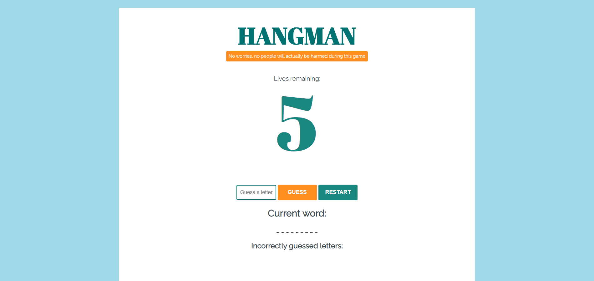

# Project 4 - Hangman

➙ [Bekijk het project](http://jannekecoumans.nl/html/hangman/index.html)

##  Doel van het project:
Refactor een werkende applicatie. Schrijf unit-tests en werk aan de styling.

## Requirements:
- Refactor de code, maar zorg dat de game blijft werken.

- Style de game zodat het gebruiksvriendelijker wordt.

- Start bij elke functionaliteit elke keer met het schrijven van unit-tests.

- Gebruik CSS Grid of Flexbox voor een mooie indeling.

- Gebruik minstens 2 animaties naar keuze.

- Gebruik styling voor de buttons. Zorg ervoor dat de kleur van de button verandert wanneer je erover hovert.